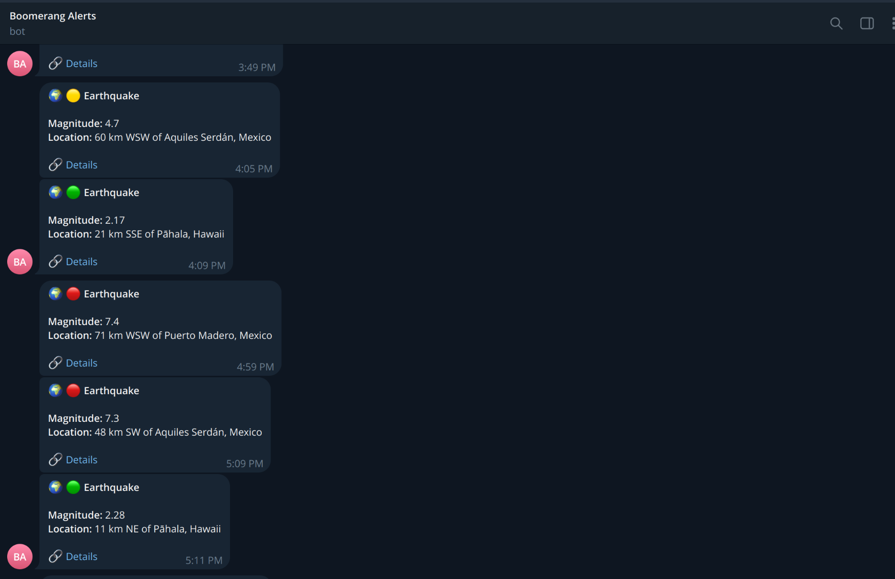

---

Alerting engine built on [Kontiki](https://github.com/kontiki-org/kontiki).

Producers emit a `NormalizedAlert`. Boomerang resolves who should be notified from
**YAML subscriptions**, then delivers on **email** or **Telegram**.

---

## Quickstart — earthquake → Telegram

The demo stack polls USGS, normalizes quakes, and notifies a Telegram chat.

**1. Bot token** (once):

```bash
cp stack/notifiers/telegram_bot_token.yaml.example \
   stack/notifiers/telegram_bot_token.yaml
# set app.telegram.bot_token from BotFather
```

**2. Start the demo:**

```bash
make stack-up-demo
```

**3. Target a chat** — subscription excerpt (operator config):

```yaml
# stack/subscription.yaml (excerpt)
app:
  subscriptions:
    demo:
      earthquakes:
        status: active
        subscription:
          rule:
            category: natural.earthquake
            event_type: earthquake
            criteria:
              all_of:
                - key: area_value
                  operator: eq
                  value: DEMO-EARTHQUAKE-1
          endpoints:
            - telegram.alerts
```

```yaml
# stack/notifiers/telegram.yaml (excerpt)
app:
  endpoints:
    alerts:
      chat_id: "YOUR_CHAT_ID"
```

When a matching quake arrives, Telegram looks like this:

<p align="center">
  
</p>

Stop the stack:

```bash
make stack-down
```

Details (pipeline, HTTP ingest, catalogues, contracts): [`docs/features.md`](docs/features.md).

---

## Documentation

- Index: [`docs/README.md`](docs/README.md)
- Features: [`docs/features.md`](docs/features.md)
- Contracts: [`docs/contracts.md`](docs/contracts.md)
- Stack config: [`stack/`](stack/)
- Contributing: [`CONTRIBUTING.md`](CONTRIBUTING.md)
- License: [`LICENSE`](LICENSE) (Apache-2.0)

| Service | README |
|---------|--------|
| Subscription | [`boomerang/services/subscription/README.md`](boomerang/services/subscription/README.md) |
| Alert engine | [`boomerang/services/alert_engine/README.md`](boomerang/services/alert_engine/README.md) |
| Email notifier | [`boomerang/services/notifiers/email/README.md`](boomerang/services/notifiers/email/README.md) |
| Telegram notifier | [`boomerang/services/notifiers/telegram/README.md`](boomerang/services/notifiers/telegram/README.md) |
| Earthquake feed (demo) | [`boomerang/services/alert_services/earthquake/README.md`](boomerang/services/alert_services/earthquake/README.md) |
